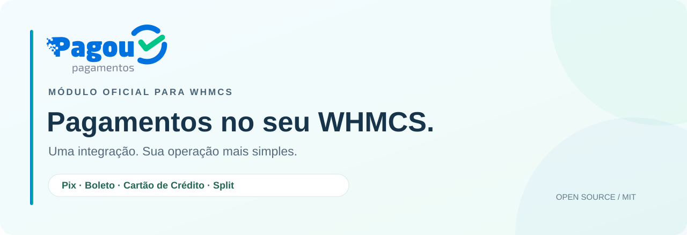
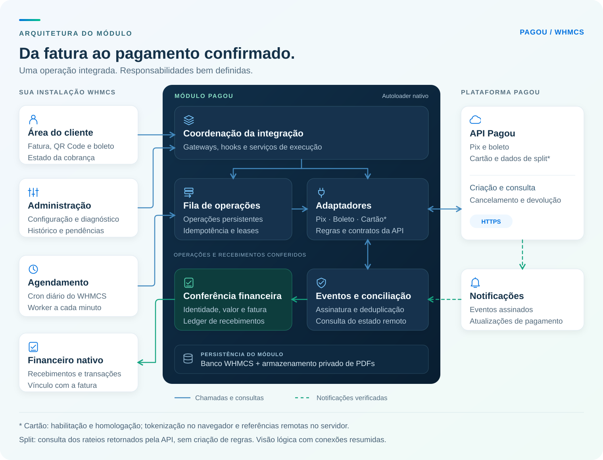
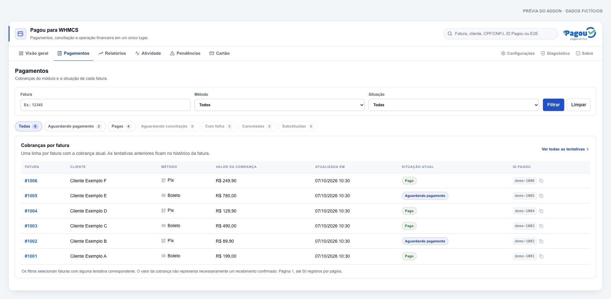
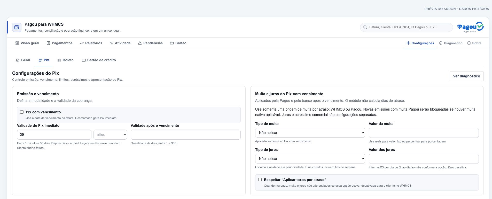

<p align="center">
  
</p>

<p align="center">
  <strong>Pagamentos integrados. Operação organizada. Código aberto.</strong><br>
  O módulo oficial da Pagou para conectar sua operação financeira ao WHMCS.
</p>

<p align="center">
  <a href="CHANGELOG.md"></a>
  <a href="#requisitos"></a>
  <a href="#requisitos"></a>
  
  <a href="#qualidade"></a>
  <a href="CHANGELOG.md"></a>
  <a href="LICENSE"></a>
</p>

<p align="center">
  <a href="https://github.com/pagou-com-br/pagou-whmcs/releases/download/v0.3.0-rc.1/pagou-whmcs-0.3.0-rc.1.zip"><strong>Baixar Pagou para WHMCS (.zip)</strong></a>
  &nbsp;·&nbsp;
  <a href="https://github.com/pagou-com-br/pagou-whmcs/releases/tag/v0.3.0-rc.1">Release notes</a>
  &nbsp;·&nbsp;
  <a href="https://github.com/pagou-com-br/pagou-whmcs/releases/download/v0.3.0-rc.1/SHA256SUMS">Checksum SHA-256</a>
</p>

<p align="center">
  <a href="#recursos">Recursos</a> ·
  <a href="#arquitetura">Arquitetura</a> ·
  <a href="#instalacao">Instalação</a> ·
  <a href="#interface">Interface</a> ·
  <a href="#documentacao">Documentação</a> ·
  <a href="#desenvolvimento">Desenvolvimento</a> ·
  <a href="#suporte">Suporte</a>
</p>

> **Candidata `0.3.0-rc.1`.** Valide a integração em uma instalação de teste antes
> de adotá-la em produção. Cartão e Split têm escopos específicos nesta versão,
> descritos na tabela de recursos e no [guia de capacidades](docs/recursos.md).

O Pagou para WHMCS conecta a emissão de cobranças, o acompanhamento dos
pagamentos e a conciliação à operação de faturamento do WHMCS. O cliente paga
pela própria fatura; a equipe administra configurações, histórico e pendências
em um addon dedicado, com a identidade da Pagou.

<a id="recursos"></a>

## Uma integração para toda a operação

- **Configuração centralizada.** Credencial, identificação do cliente, encargos,
  apresentação, e-mails e PDFs organizados no addon.
- **Pagamento na própria fatura.** QR Code, copia e cola, linha digitável,
  acesso ao boleto e atualização do estado da cobrança.
- **Operação acompanhada.** Histórico por fatura, relatórios, busca,
  conciliação, pendências e diagnóstico da integração.
- **Processamento com continuidade.** Fila persistente, worker próprio e
  controle da identidade das operações para acompanhar resultados incertos.
- **Recebimento integrado ao WHMCS.** Conferência do pagamento e registro pelos
  mecanismos financeiros nativos, com proteção contra duplicidade.
- **Instalação direta.** Um ZIP com `modules/`, autoloader nativo e nenhuma
  necessidade de executar Composer no servidor WHMCS.

### Pix, Boleto, Cartão de Crédito e Split

| Recurso | Experiência oferecida | Escopo da candidata |
| --- | --- | --- |
| **Pix** | Cobrança imediata ou com vencimento, QR Code, copia e cola, confirmação e devolução pelo WHMCS | Implementado; valide a configuração da conta e da instalação |
| **Boleto** | Emissão, linha digitável, página de pagamento, PDF e encargos configuráveis | Implementado; depende da habilitação da conta Pagou |
| **Cartão de crédito** | Tokenização no navegador, referências remotas e acompanhamento da transação | Condicionado à habilitação e à homologação. Uma parcela com captura automática |
| **Split** | Consulta e apresentação dos dados de rateio retornados pela Pagou | Sem criação ou edição de regras de divisão. Split de cartão indisponível |

As capacidades da API e do módulo podem ter abrangências diferentes. Os
[recursos e limites](docs/recursos.md) detalham o comportamento desta versão.

<a id="arquitetura"></a>

## Arquitetura

A integração separa a experiência no WHMCS, a coordenação dos pagamentos e a
comunicação com a Pagou. Operações persistentes, notificações verificadas e
conciliação compartilham as evidências necessárias para conferir cada recebimento.

[](assets/architecture.svg)

<p align="center"><sub>Visão lógica do módulo. Clique na imagem para ampliar.</sub></p>

### Da emissão à confirmação

1. **A fatura inicia o fluxo.** Gateways e hooks acionam os serviços do módulo.
   O cron diário agenda o lote; ações interativas avançam a fatura selecionada.
2. **A operação mantém sua identidade.** A fila e o worker coordenam o trabalho
   persistente. Os adaptadores aplicam as regras de cada meio na comunicação
   com a API Pagou.
3. **O resultado é conferido.** Notificações verificadas e consultas de
   conciliação permitem acompanhar o estado remoto, inclusive após interrupções.
4. **O WHMCS recebe o lançamento.** Identidade, valor e fatura são conferidos
   antes do registro financeiro. O ledger controla a aplicação e a deduplicação.

| Camada | Responsabilidade |
| --- | --- |
| **Addon e gateways** | Configuração administrativa, ações na fatura, hooks e endpoints |
| **Serviços de execução** | Emissão, agendamento, acompanhamento, PDFs, e-mails e conciliação |
| **Adaptadores Pagou** | Contratos e conversões específicos de Pix, boleto e cartão |
| **Persistência e ledger** | Operações, tentativas, evidências e controle dos recebimentos |
| **Integração nativa WHMCS** | Identidade das faturas, transações e lançamento dos pagamentos |

→ [Conheça os componentes e os limites da arquitetura](docs/arquitetura.md)

<a id="download"></a>

## Downloads e notas da versão

**`0.3.0-rc.1`** é a primeira candidata da distribuição pública. Ela reúne o
addon administrativo, os gateways, os fluxos de Pix e boleto, a integração de
cartão sob habilitação e a consulta de informações de split.

| Arquivo | Finalidade |
| --- | --- |
| [**pagou-whmcs-0.3.0-rc.1.zip**](https://github.com/pagou-com-br/pagou-whmcs/releases/download/v0.3.0-rc.1/pagou-whmcs-0.3.0-rc.1.zip) | Pacote instalável, contendo somente `modules/` |
| [**SHA256SUMS**](https://github.com/pagou-com-br/pagou-whmcs/releases/download/v0.3.0-rc.1/SHA256SUMS) | Checksum para conferir a integridade do ZIP |
| [**RELEASE_NOTES.md**](https://github.com/pagou-com-br/pagou-whmcs/releases/download/v0.3.0-rc.1/RELEASE_NOTES.md) | Notas que acompanham o pacote desta versão |

Consulte o [changelog](CHANGELOG.md), a
[página desta release](https://github.com/pagou-com-br/pagou-whmcs/releases/tag/v0.3.0-rc.1)
ou [todas as versões](https://github.com/pagou-com-br/pagou-whmcs/releases).
Os arquivos automáticos **Source code** do GitHub contêm o projeto de
desenvolvimento; para instalar, utilize o ZIP identificado na tabela.

<a id="requisitos"></a>

## Requisitos e compatibilidade

| Componente | Requisito |
| --- | --- |
| WHMCS | 8.6 ou superior, dentro da linha 8.x |
| PHP | 8.1 ou superior, em versão aceita pelo WHMCS instalado |
| Conta Pagou | Credencial válida e meios de pagamento habilitados |
| Servidor | HTTPS, acesso à API Pagou e PHP CLI para o worker |

WHMCS **8.13** é a referência de validação registrada no módulo. A faixa acima
expressa a compatibilidade pretendida; não representa uma homologação individual
de todas as combinações de PHP, WHMCS e temas.

<a id="instalacao"></a>

## Instalação rápida

1. **Faça backup** dos arquivos, banco e personalizações do WHMCS. Valide a
   versão primeiro em uma instalação de teste.
2. **Baixe o ZIP e o checksum** da mesma release. Na pasta dos arquivos, confira:

   ```sh
   shasum -a 256 -c SHA256SUMS
   ```

3. **Extraia `modules/` na raiz do WHMCS**, preservando os demais módulos.
4. **Ative o addon Pagou Payments**, conceda as permissões administrativas
   necessárias e configure credencial e campos de CPF/CNPJ.
5. **Configure notificações e meios de pagamento.** Ative os gateways
   habilitados para sua conta e revise suas opções no addon.
6. **Agende o worker a cada minuto**, mantendo também o cron nativo do WHMCS:

   ```cron
   * * * * * php /caminho/do/whmcs/modules/addons/pagou_payments/cron.php
   ```

7. **Confira o diagnóstico** e valide emissão, confirmação, lançamento nativo,
   e-mail e PDF antes de disponibilizar os meios aos clientes.

A integração dos PDFs ao tema é uma ação separada, apresentada para revisão
no addon. **Não é necessário instalar Composer no servidor WHMCS.**

→ [Instalação, atualização e recuperação, passo a passo](docs/instalacao.md)

<a id="interface"></a>

## Uma visão clara dos pagamentos

Cobranças agrupadas por fatura, identificação do meio, valor, estado atual e
acesso ao histórico para acompanhar a operação.



<details>
<summary><strong>Ver a configuração dos meios de pagamento</strong></summary>

As opções ficam organizadas por meio de pagamento, com vencimento, encargos,
limites e apresentação reunidos no addon.



</details>

As capturas mostram componentes reais do addon renderizados com dados fictícios,
fora de uma instalação WHMCS. A aparência final também depende do tema e da
versão do WHMCS.

<a id="documentacao"></a>

## Documentação

| Guia | O que você encontra |
| --- | --- |
| [Instalação e atualização](docs/instalacao.md) | Pacote, configuração inicial, cron, webhooks e recuperação |
| [Recursos e limites](docs/recursos.md) | Pix, boleto, cartão, split e confirmação de pagamentos |
| [Arquitetura do módulo](docs/arquitetura.md) | Componentes, processamento, persistência e fronteiras da integração |
| [Multa, juros e acréscimos](docs/encargos.md) | Unidades, revisão de configurações e relação com o WHMCS |
| [PDFs e e-mails](docs/pdfs-e-emails.md) | Integração com o tema, anexos e links de pagamento |
| [Reembolso de Pix](docs/reembolsos.md) | Devolução total ou parcial pelo fluxo nativo |
| [Diagnóstico e suporte](docs/suporte.md) | Investigação de falhas e canais de atendimento |
| [Histórico de versões](CHANGELOG.md) | Mudanças da distribuição pública |

A [documentação da API Pagou](https://docs.pagou.com.br) complementa os guias.
As capacidades efetivamente disponíveis neste checkout estão descritas no módulo.

## Segurança no fluxo de pagamento

- **Notificações verificadas:** conferência da assinatura e deduplicação da entrega.
- **Identidade e valor conferidos:** o estado remoto, isoladamente, não determina
  o lançamento de um recebimento no WHMCS.
- **Operações rastreáveis:** resultados incertos são conciliados usando a
  identidade original da operação.
- **Cartão tokenizado no navegador:** o servidor utiliza referências remotas;
  número completo e CVV não devem ser persistidos ou aparecer em logs.
- **Acesso contextual:** endpoints conferem cliente, fatura e autorização da ação.

Para relatar uma vulnerabilidade, use o [canal privado de segurança](SECURITY.md).

<a id="qualidade"></a>

## Qualidade e validação

A candidata `0.3.0-rc.1` foi validada localmente com **545 testes PHP** e
**36 testes JavaScript**, além de PHPCS, PHPStan, verificações de autoload,
conteúdo público, montagem e conferência do pacote. A execução PHP usou **8.2**.
O badge de testes representa essa execução local da candidata.

A cobertura inclui contratos da API, valores e encargos, idempotência,
conciliação, confirmações, reembolsos, configuração e comportamento da interface.
Os testes nativos que exigem uma distribuição licenciada do WHMCS e banco
descartável são executados separadamente, conforme o
[guia de contribuição](CONTRIBUTING.md). Testes automatizados não substituem a
homologação financeira dos meios de pagamento.

<a id="desenvolvimento"></a>

## Desenvolvimento

O repositório inclui fontes, testes e ferramentas para construir o pacote.
Use PHP 8.1+, Composer 2, Python 3.10+, Node.js 22+, Bash, `unzip` e `shasum`.
As dependências do Composer pertencem ao ambiente de desenvolvimento.

```sh
git clone https://github.com/pagou-com-br/pagou-whmcs.git
cd pagou-whmcs
composer install
composer check
```

`composer check` executa os testes PHP e JavaScript, análise estática,
verificações do conteúdo público e construção e conferência do ZIP.
Para apenas construir o pacote depois de preparar o ambiente:

```sh
composer build
```

O resultado fica em `build/`, acompanhado de `SHA256SUMS`.

```text
package/
  modules/
    addons/pagou_payments/    Addon, hooks, endpoints, migrations e assets
    gateways/pagou/          Autoloader, regras, serviços e adaptadores
    gateways/pagou_*.php     Entradas dos gateways nativos
    gateways/callback/      Retornos e notificações
tests/                      Contratos, unidade, integração, segurança e interface
docs/                       Guias de uso e arquitetura
assets/                     Imagens da documentação
scripts/                    Verificação e construção do pacote
```

Contribuições são bem-vindas. Leia [CONTRIBUTING.md](CONTRIBUTING.md), descreva
o problema e a validação no pull request e utilize dados fictícios.

## Perguntas frequentes

<details>
<summary><strong>Preciso instalar Composer no servidor?</strong></summary>

Não. O ZIP contém o código instalável e seu autoloader. Composer é utilizado
para desenvolver, testar e construir o pacote.

</details>

<details>
<summary><strong>Posso habilitar todos os recursos imediatamente?</strong></summary>

A habilitação depende da conta Pagou e das capacidades do módulo. Pix e boleto
precisam de configuração e validação; cartão requer habilitação e homologação
próprias. O split desta candidata consulta os dados retornados pela API.
Veja o [escopo de cada recurso](docs/recursos.md).

</details>

<details>
<summary><strong>O cron nativo do WHMCS é suficiente?</strong></summary>

Mantenha o cron nativo e configure também o worker Pagou a cada minuto.
Ações interativas avançam a fatura selecionada, enquanto o worker acompanha
operações, documentos e entregas pendentes.

</details>

<details>
<summary><strong>A instalação migra cobranças de outros gateways?</strong></summary>

Não há migração automática. Faturas antigas devem preservar seu meio original
enquanto houver cobranças a acompanhar. Consulte o [guia de atualização](docs/instalacao.md).

</details>

<a id="suporte"></a>

## Suporte e comunidade

| Assunto | Canal |
| --- | --- |
| Falha reproduzível ou sugestão para o módulo | [Issues do projeto](https://github.com/pagou-com-br/pagou-whmcs/issues) |
| Conta Pagou, credencial ou operação financeira | [suporte@pagou.com.br](mailto:suporte@pagou.com.br) |
| Vulnerabilidade | [Orientações de segurança](SECURITY.md) |
| Plataforma e integração | [Site Pagou](https://pagou.com.br) · [Documentação da API](https://docs.pagou.com.br) |

Nos relatos públicos, use dados fictícios. Credenciais, informações de clientes
e evidências financeiras devem permanecer nos canais privados apropriados.

## Licença

Distribuído sob a [licença MIT](LICENSE). A licença do módulo não substitui a
licença do WHMCS nem as condições dos serviços Pagou. O pacote inclui FPDI,
com sua [licença MIT](package/modules/gateways/pagou/vendor/fpdi/LICENSE.txt).

<p align="center"><strong>Pagou. Pagamentos conectados à sua operação.</strong></p>
